<p align="center">
  
</p>

<p align="center"><i>Everything in this lab is built so someone else can learn from it.</i></p>

## `> ./teach --everyone`

Every repo here is a lesson, not just a portfolio piece:

- **Step by step.** Each project walks you from zero to working code.
- **Explained code.** Comments tell you *why*, not only *what*.
- **Real mistakes.** Failed experiments stay in the history. Debugging is part of the lesson.
- **Beginner-first.** If you can open a terminal, you can follow along.

> The best way to learn is to teach. The best way to teach is to ship code people can read.

## `> sudo ./2tim --chapter 3 --verse 16-17`

```diff
@@ 2 Timothy 3:16-17 :: boot log @@
+ [boot] all scripture ......... loaded (inspiration of God)
+ [ ok ] doctrine .............. read the docs
+ [ ok ] reproof ............... code review
+ [ ok ] correction ............ git commit -m "fix"
+ [ ok ] instruction ........... model.fit(righteousness)
! [done] man_of_god ............ throughly furnished unto all good works
```

> *All scripture is given by inspiration of God, and is profitable for doctrine, for reproof, for correction, for instruction in righteousness: That the man of God may be perfect, throughly furnished unto all good works.*
>
> **2 Timothy 3:16-17** (KJV)

Teach, review, correct, train. The same loop I use to learn, and the one I pass on.

## `> ./connect`

- Stuck on something in my repos? **Open an issue.** Questions are welcome here.
- Found a bug? **Send a PR.** That's `reproof` + `correction` in action.

<p align="center"><code>fork it · break it · learn from it · teach it back</code></p>
